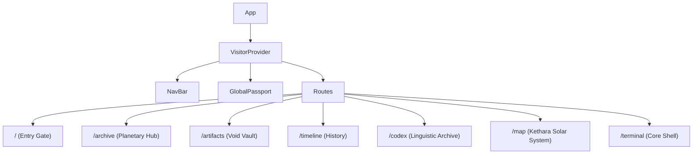

# 🏗️ System Architecture: Xenova Archive

This document outlines the technical design, state management, and visual effects pipeline of the Xenova Archive.

## 🏛️ Core Design Principles
1. **Immersive Aesthetics**: Every UI element must feel like an in-universe artifact.
2. **Deterministic Lore**: All planetary and relic data is centralized to ensure consistency across the Terminal, Map, and Codex.
3. **High Performance**: 3D elements and heavy animations are optimized via selective post-processing and efficient React lifecycle management.

---

## 🛰️ Component Hierarchy & Routing
The application uses `react-router-dom` for navigation, wrapped in a `VisitorProvider` to maintain persistent state.

---

## 🛂 State Management: VisitorContext
The `VisitorContext` is the "brain" of the archive. It tracks the operative's journey:
- **`visitedPlanets`**: A set of unique planet IDs discovered.
- **`viewedRelics`**: A set of artifact IDs inspected in the vault.
- **`decodedCodexEntries`**: Progress in the linguistic archive.
- **`bypassForJudge`**: A mechanism to unlock all content for administrative review.

Persistence is handled via `localStorage` and optionally synced with `Firebase` for authenticated users.

---

## 🪐 3D Pipeline (Three.js)
The 3D experience is built using **React Three Fiber (R3F)**:
- **Shaders**: Custom GLSL is used for planetary atmospheres and the "Nebula" backgrounds.
- **Post-processing**: The `Artifacts` page uses a selective `Glitch` and `Bloom` pass to emphasize the "unstable" nature of recovered relics.
- **Drei**: Heavily utilizes `Float`, `PresentationControls`, and `Environment` for premium object viewing.

---

## 📟 The Terminal Logic
The Terminal is an adaptive system. Its "Knowledge Assessment" (`begin_evaluation`) builds a dynamic question pool based on the user's actual progress:
1. It queries `VisitorContext` for current progress.
2. It filters a master question bank to only include topics the user has "encountered."
3. It uses a custom **Levenshtein distance** algorithm for fuzzy string matching on answers, allowing for minor typos without breaking immersion.

---

## 📜 Linguistic System (Codex)
The Codex uses a 1:1 mapping system between English characters and a custom Xenovan symbol set (`GLYPH_MAP`).
- **Scramble Effect**: A custom hook `useScrambleDecode` manages the "decrypting" animation seen across the UI.
- **Bi-directional Encoding**: The Cipher Tool supports both encoding English to Xenovan and decoding Xenovan back to English.

---

## ⚡ Performance Optimizations
- **Lenis**: Integrated for smooth, inertia-based scrolling that feels premium on all input devices.
- **GSAP Context**: Used for safe animation cleanup to prevent memory leaks during rapid page transitions.
- **Post-processing Selectivity**: Post-processing effects are only active when a 3D scene is in view.
