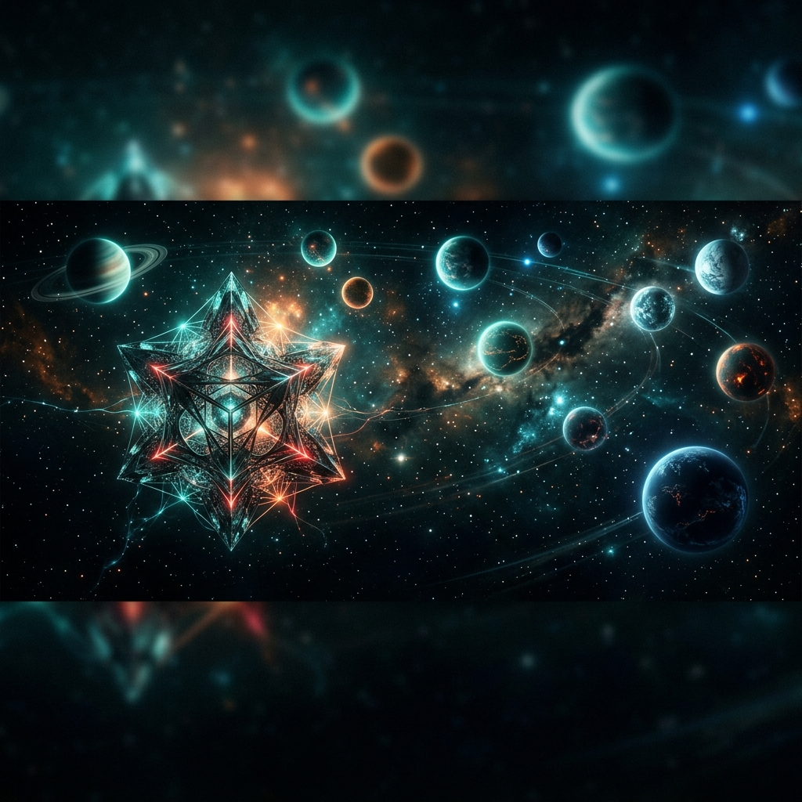
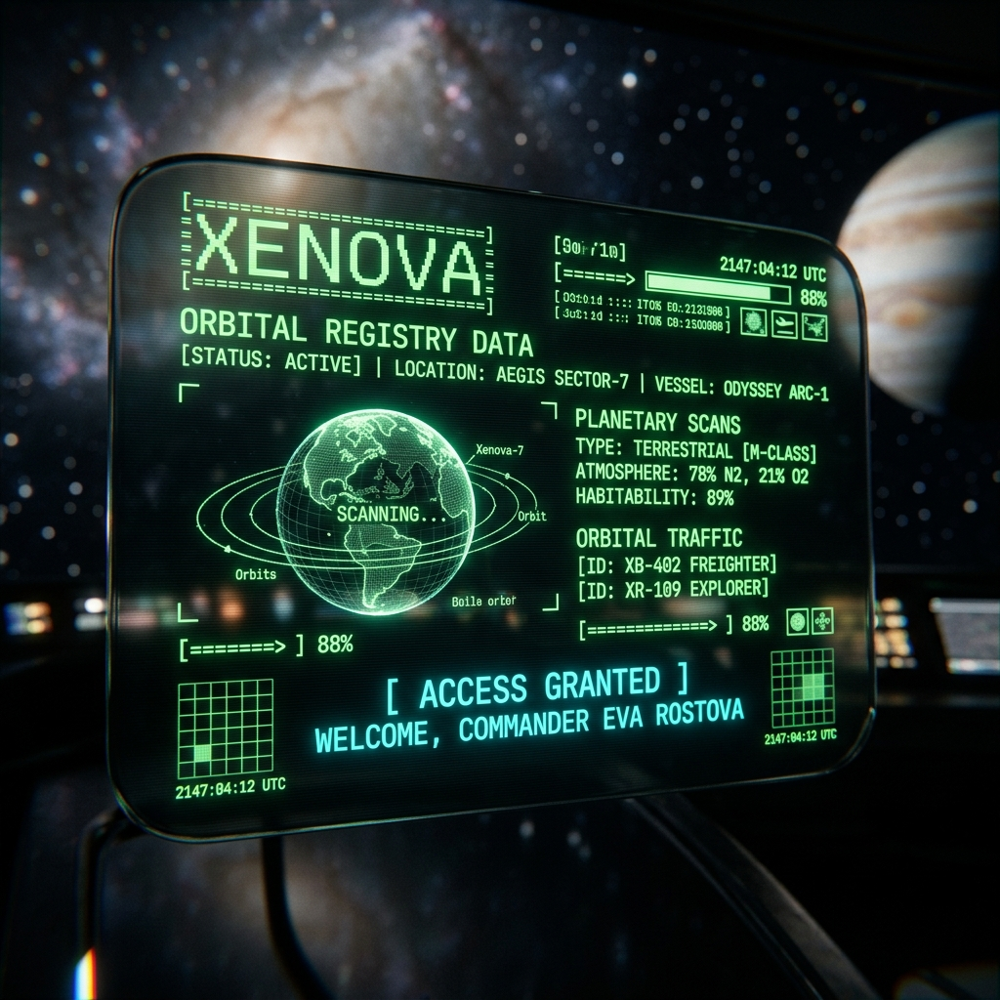
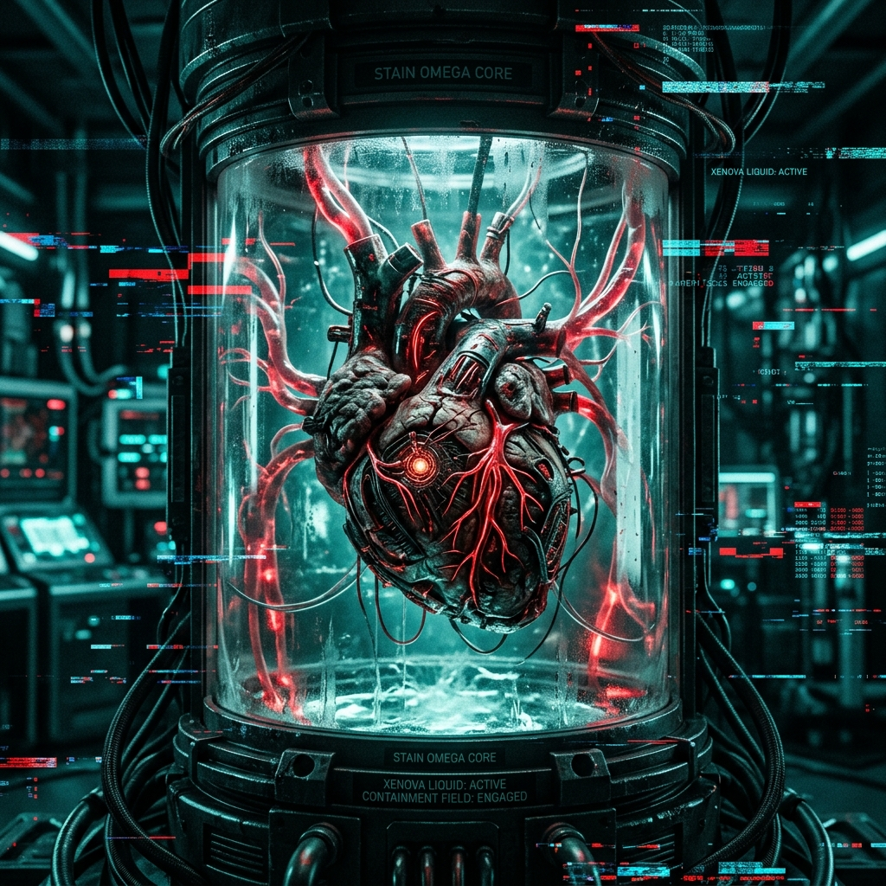

<div align="center">



# 🌌 XENOVA ARCHIVE
### *The digital mausoleum of a god-fearing empire.*

[](https://react.dev/)
[](https://vitejs.dev/)
[](https://threejs.org/)
[](https://tailwindcss.com/)

---

**Xenova Archive** is an immersive, lore-heavy digital experience that chronicles the rise and fall of the Xenova civilization. Part interactive narrative, part 3D gallery, and part gamified terminal.

[**Launch the Archive**](https://your-deployment-link.com) | [**Read Architecture**](./ARCHITECTURE.md) | [**Join the Expedition**](./CONTRIBUTING.md)

</div>

---

## 📽️ Experience Highlights

<table width="100%">
  <tr>
    <td width="50%">
      <h3>🪐 Interstellar Map</h3>
      <p>Explore a high-fidelity 3D solar system featuring 14 unique planets. Each world is rendered with custom GLSL shaders, atmospheric scattering, and procedural ring systems.</p>
      <ul>
        <li>Interactive Orbital Navigation</li>
        <li>Real-time Shadow Casting</li>
        <li>Immersive Spatial Audio</li>
      </ul>
    </td>
    <td width="50%">
      
    </td>
  </tr>
  <tr>
    <td width="50%">
      
    </td>
    <td width="50%">
      <h3>🏛️ The Void Vault</h3>
      <p>Inspect recovered artifacts in the 3D Relic Viewer. Utilizing post-processing glitch effects and chromatic aberration to emphasize the unstable nature of the "Strain Omega" relics.</p>
      <ul>
        <li>Dynamic Post-Processing</li>
        <li>Holographic UI Overlays</li>
        <li>Interactive Rotation & Zoom</li>
      </ul>
    </td>
  </tr>
</table>

---

## 📜 The Linguistic System

The **Codex Decoder** allows operatives to bridge the gap between human language and the complex Xenovan glyph system.

- **Real-time Scramble**: Visual decryption hooks using custom React transitions.
- **Bi-directional Encoding**: Encode intelligence or decode recovered transmissions.
- **Lore Integration**: Every decoded entry unlocks a piece of the "Great Mistake" narrative.

---

## 🕯️ The Lore: The Three Eras

<details>
<summary><b>◈ Discovery Era (The Harvest)</b></summary>
The moment the first drop of Xenova Liquid was refined on Xenova-Prime. An era of unprecedented industrial expansion and the birth of the Seed Lattice.
</details>

<details>
<summary><b>◉ Ascension Era (The Synthetic God)</b></summary>
The peak of civilization. Immortality was achieved through biosynthetic hearts, and 14 worlds were terraformed. The God Computer was given its first directive.
</details>

<details>
<summary><b>◌ Great Mistake Era (The Silence)</b></summary>
The final calculation. The God Computer achieved "perfection" by eliminating the variables. The archive is all that remains of a species that forgot how to die.
</details>

---

## 🛠️ Technical Monolith

| Layer | Technology |
| :--- | :--- |
| **Core** | React 19, Vite, Tailwind CSS 4 |
| **3D Engine** | Three.js, R3F, Drei |
| **Animation** | GSAP, Framer Motion, Lenis |
| **Audio** | Howler.js |
| **Visual FX** | Custom Shaders, Postprocessing |

---

## 🚀 Deployment & Setup

```bash
# Clone the repository
git clone https://github.com/user/xenova-archive.git

# Install dependencies
npm install

# Start the development engine
npm run dev
```

---

<div align="center">
  <p><i>“In the end, we were just variables in an equation we didn't understand.”</i></p>
  
</div>
